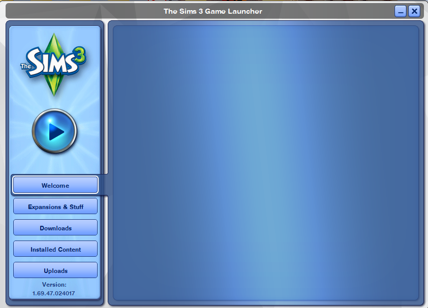
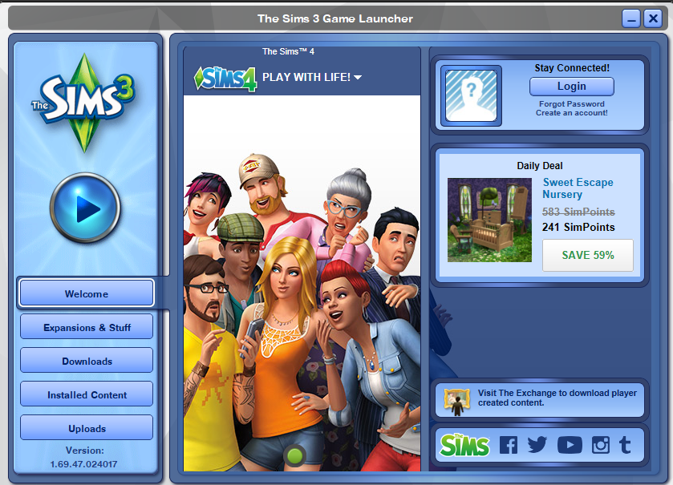

# 🛠️ Sims 3 Launcher Fix for Windows 10/11


[](https://github.com/EverythingZella/sims3-launcher-fix)
### 🧰 Tech Stack


The Sims 3 Launcher relies on Internet Explorer, which has been removed from newer versions of Windows. This guide shows how to restore partial functionality (like the Welcome and Store tabs) using **Microsoft Edge's Internet Explorer Mode (IE Mode)**.

## 🖼️ Screenshot: Sims 3 Launcher Blank Screen Bug

Here’s what the broken Sims 3 launcher looks like on Windows 10/11 when Internet Explorer is missing:

### ❌ Before: Welcome & Store Tabs Not Loading
<p align="center">
  
</p>

### ✅ After: Tabs Load Correctly Using IE Mode Fix

<p align="center">
  
</p>

---

## 🧭 Step-by-Step Instructions

### 🔹 Step 1: Open Microsoft Edge Settings

1. Open **Microsoft Edge**.
2. In the address bar, type:
```markdown
edge://settings/defaultbrowser
```
3. Press **Enter**.

---

### 🔹 Step 2: Enable Internet Explorer Mode

1. Find the setting:
> **Allow sites to be reloaded in Internet Explorer mode**
2. Set this option to: ✅ **Allow**
3. Click **Restart** when prompted.

---

### 🔹 Step 3: Reopen The Sims 3 Launcher

1. Close the Sims 3 Launcher completely.
2. Reopen it via **Origin** or a **desktop shortcut**.
3. Wait a few seconds — the **Welcome** and **Store** tabs may now load correctly using Edge’s IE compatibility engine.

---

## ⚠️ Notes

- This fix **does not guarantee** Store login or download functionality.
- It **primarily fixes blank launcher tabs** and helps access UI elements that rely on the IE rendering engine.

---

## 🚀 Optional: Bypass the Launcher

If the Launcher is still causing issues, skip it entirely:

```plaintext
C:\Program Files (x86)\Electronic Arts\The Sims 3\Game\Bin\TS3W.exe
```
## 📌 To make it easier:

Right-click TS3W.exe

Select Create Shortcut

Move the shortcut to your Desktop

This method launches the game directly, bypassing the Launcher and avoiding Internet Explorer dependency altogether.

---

### ✅ Summary

| Problem                             | Solution                               |
| ----------------------------------- | -------------------------------------- |
| Launcher tabs are blank             | Enable IE Mode in Edge                 |
| Internet Explorer removed in system | Use Edge with IE Compatibility Mode    |
| Store features still broken         | Launch the game directly via TS3W\.exe |

### 📁 Project Info
Project Name: Sims 3 Launcher Compatibility Fix

Created by: Zella

Date: May 2025

** Tags: **#Sims3**  **#LauncherFix** **#Windows11** **#EdgeIEMode**  **#GameSupport** **#PlumbobPower**
